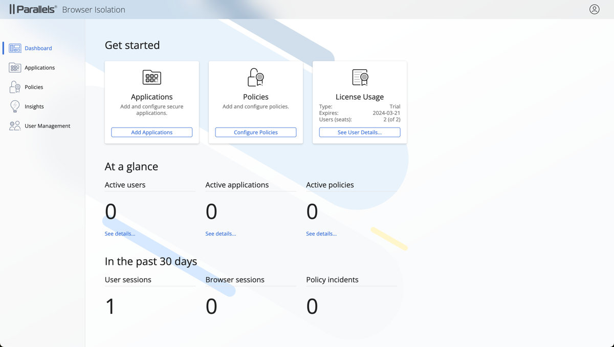
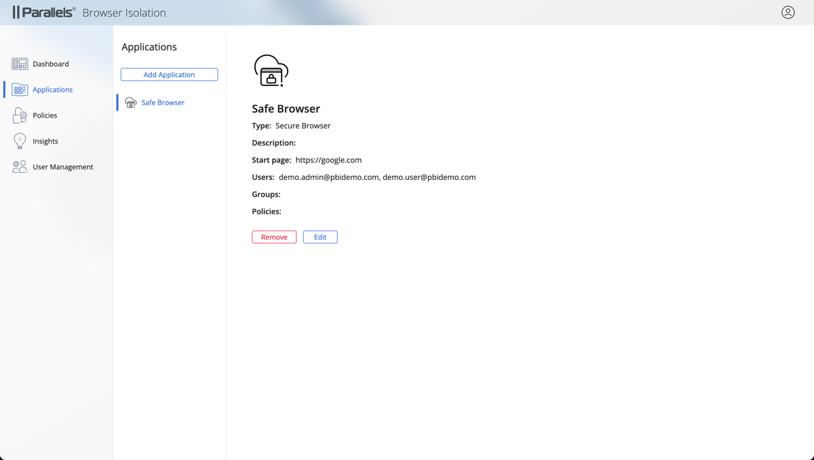
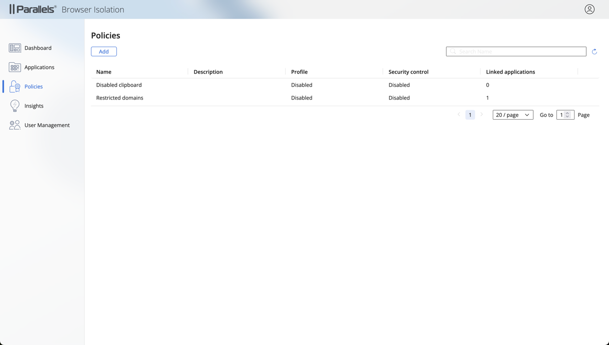
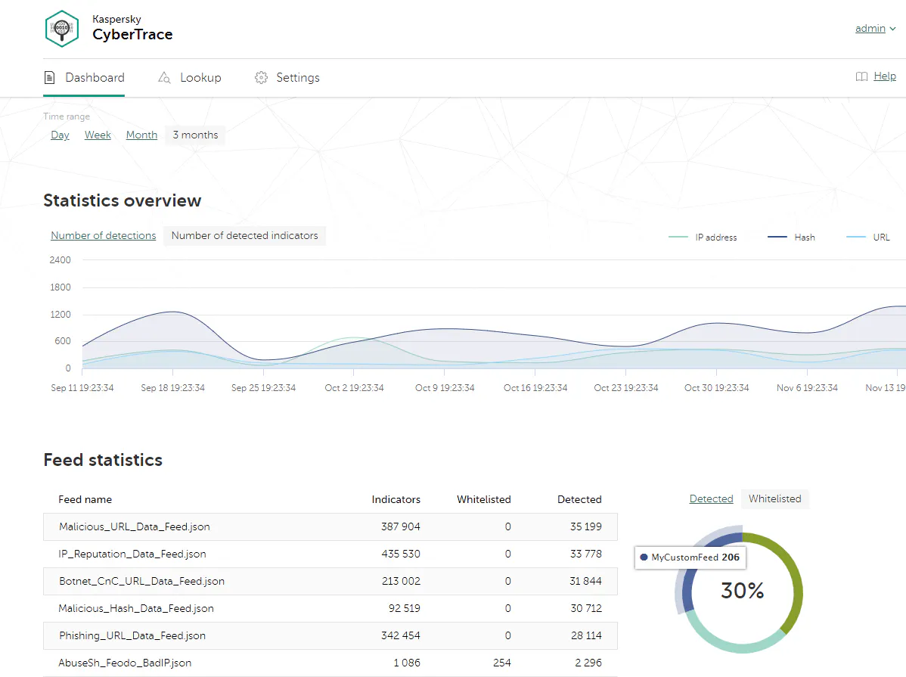
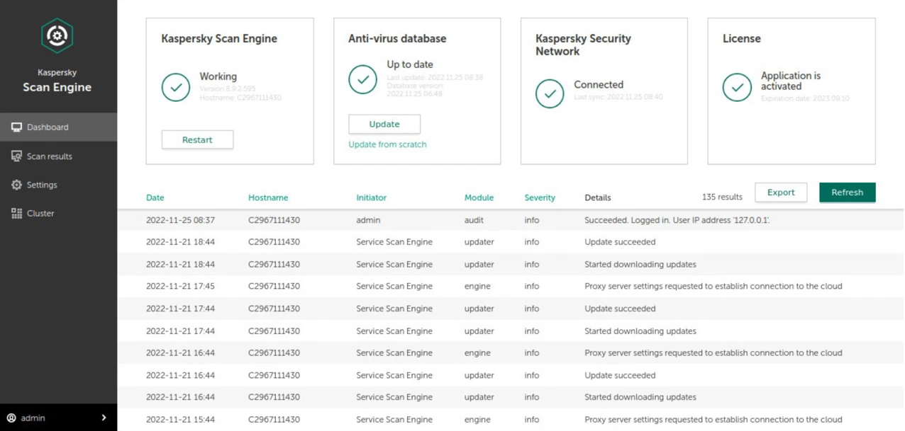
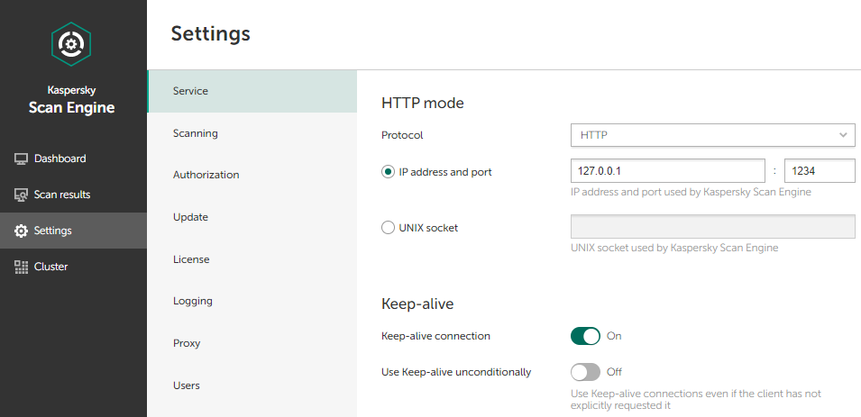

# Parallels Browser Isolation

Parallels Browser Isolation is a SaaS solutions that allows system administrators to configure secure access to web applications for end users.

## UI writing goals

- Establish a workflow for reviewing UI text
- Develop a consistent voice for the product
- Provide the team with guidelines on capitalization and terminology
- Advice on possible improvements of UX through text

## My approach

### Establish a workflow for reviewing UI text

I discussed the workflow with the product manager and the dev team lead, and we agreed on the following process:

1. The designer creates mockups in Zeplin
2. The product manager suggests UI text in mockups or the relevant FDs (feature descriptions) 
3. I check the text and suggest improvements
4. The product manager updates the UI text

### Develop a consistent voice for the product

The product is divided into two SaaS services: Parallels Browser Isolation Management Portal for system administrators and Parallels Browser Isolation User Portal for end users. For both services, the product vision emphasizes security, speed, and ease of use. 

After reviewing the features and the initial text proposed by the product manager, I decided that the product voice should convey the following concepts:

- Simple — text must convey simplicity as emphasized in the product vision.
- Technical — for Parallels Browser Isolation Management Portal only. Since this service is used by system administrators, the text should provide enough technical details for them to work comfortably.
- Modern — most of the previous Parallels products are on-prem, and the move to the cloud should be emphasized with a more modern voice.

### Provide the team with guidelines on capitalization and terminology

During the development, the product teams asked me to develop guidelines on capitalization that can be used in the product UI and in future SaaS products. A lot of Parallels products are developed with the Mac audience in mind, which means that Title Case is used for most of UI text. The product management team wanted to find a balance between Title Case and sentence case that would be appropriate for a SaaS product. I conducted an audit of the UI elements and suggested a capitalization style of each of them.

I also created a table of generic terms that were frequently used in UI and in materials associated with the products (documentation, release notes, product-related emails) that can be used as a single source of truth.

### Advice on possible improvements of UX through text

When I see an opportunity to improve UX by adding, moving, or changing text, I discuss it with the product manager, the development lead, and the designer. 

## Result

# Kaspersky CyberTrace and Kaspersky Scan Engine

Kaspersky CyberTrace and Kaspersky Scan Engine are on-prem security solutions for enterprises. 

## UI writing goals

- Establish a workflow for reviewing UI text
- Develop a consistent voice for the product

## My approach
### Establish a workflow for reviewing UI text

Since our team has not worked on projects with GUI before, we had to consult other teams and adapt some of their methodologies for our case. 

We established a workflow that worked for both projects:
1. Initially, all UI text was created by system analysts and designers.
2. Every 2-3 weeks the developer team exported the text from the products and packed it into a Passolo bundle.
3. I compared the text to the GUI on the test servers to make sure that I understood the context. If the purpose of a feature was unclear, I consulted the system analyst.
4. I edited the text in Passolo and sent it back to the developer team.
5. The developer team imported the text to the test server.
6. The updated text was validated by the system analyst.
### Develop a consistent voice for the product

Luckily for me, Kaspersky already had voice and tone guidelines in place. The Kaspersky product voice is meant to evoke confidence, safety, and futuristic feel. I just had to make sure that the UI text was aligned with those concepts:
- Confidence — text should be short, clear, and easy to read.
- Safety — consequences of all actions should be clearly described.
- Futuristic feel — the cutting-edge aspect of technologies should be emphasized.

## Result

